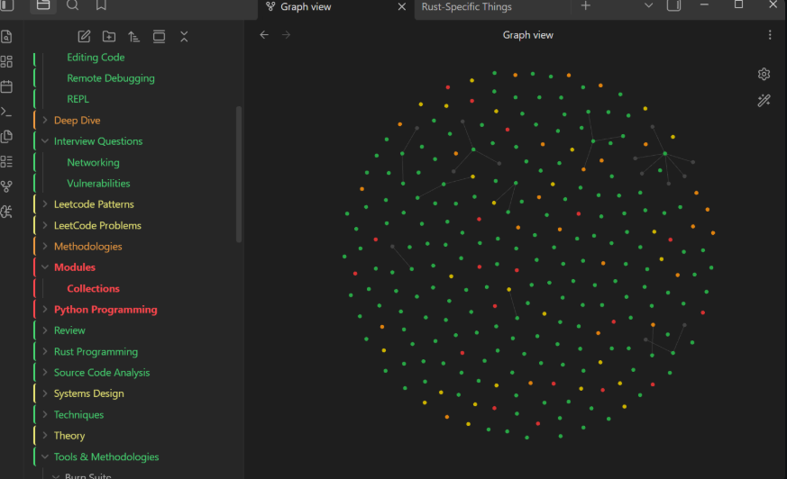

An Obsidian plugin for spaced-repetition visualization of your notes.

Grade a note with Again/Hard/Good/Easy (SM-2 Algorithm), and the plugin schedules the next review and
color-codes the whole vault by how overdue each note is.

## Features

- File explorer notes are colored green/yellow/orange/red by how overdue they are.
- Folders are tinted by the share of their notes that are still fresh (green).
- Graph view nodes can be colored too, via a `review_status` property and color
  groups.
- Existing notes are seeded from their file date so the vault isn't blank on day one.
  

- Grade notes from a bar at the top of each note. Each button shows the interval
  it will schedule.
- Grading cooldown to avoid accidentally spamming a note's interval.

## Install
- Open Obsidian
- Enable community plugins - Go to Settings → Community plugins → Turn on community plugins
- Install Note Decay - Click "Browse" → Search for "Note Decay" → Install

## Frontmatter

Grading a note writes:

```yaml
last_reviewed: 2026-06-26
sr_due: 2026-07-02
sr_interval: 6
sr_ease: 2.5
sr_reps: 2
sr_lapses: 0
```

## Graph colors

Add color groups in Graph view settings matching `["review_status":"green"]` etc.,
or let the plugin write the property and set them up once.

Copy `main.js`, `manifest.json`, and `styles.css` into
`<vault>/.obsidian/plugins/note-decay/`.

## License

MIT
